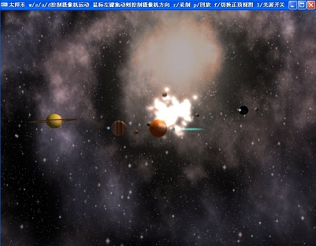
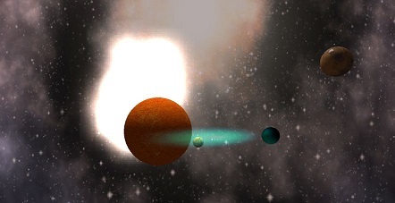

本Demo写于2008年

程序说明：

1. w/s/a/d/控制摄像机线性运动
2. 鼠标左键+拖动 控制摄像机pitch/yaw角度
3. l/控制灯光切换
4. r/录制 p/回放
5. f/切换正视图与顶视图
6. esc键退出程序

源代码组织：

1. base.h 常用c运行库包含
2. vec3.h 矢量数学
3. glCamera.h gl摄像机简单封装
4. glDrawer.h glu二次曲面封装
5. glSkyBox.h 天空盒绘制
6. glTexture.h 纹理和bmp图像以及tga图像读取
7. planet.h 行星对象
8. glparticle.h 例子系统
9. glexploation.h 爆炸系统
10. gltrail.h  billboard poly chain技术
11. tga.h tga图像读取
12. main.cpp main函数入口代码

billboardingtut.pdf ---> opengl版billboard技术文档，非常详细，易于理解